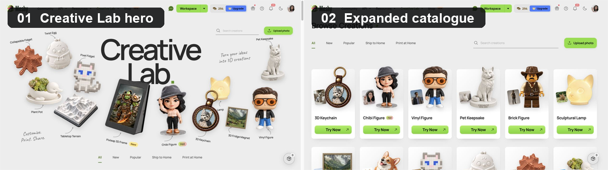
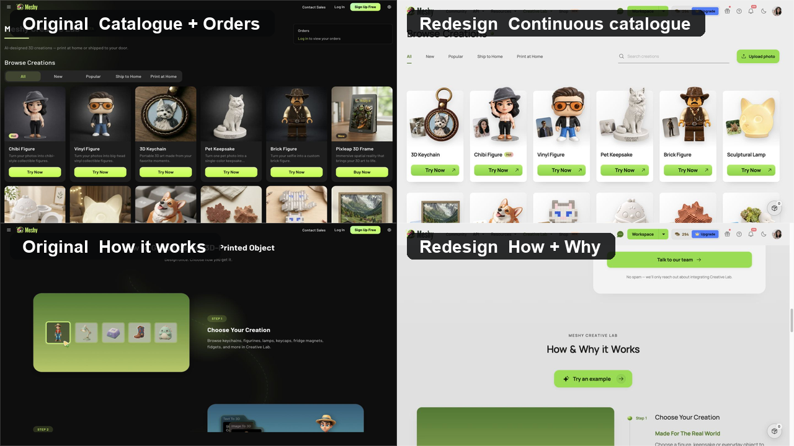
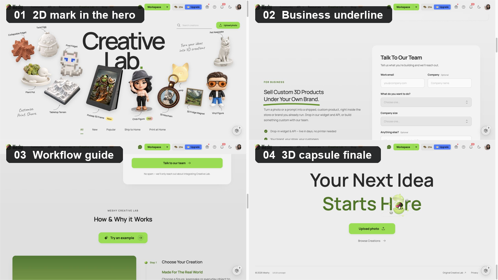
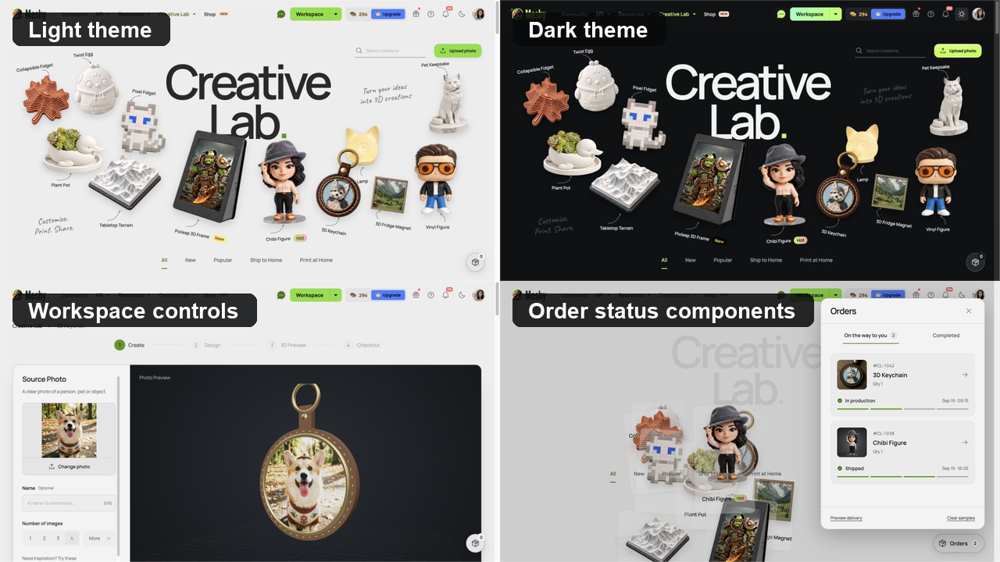
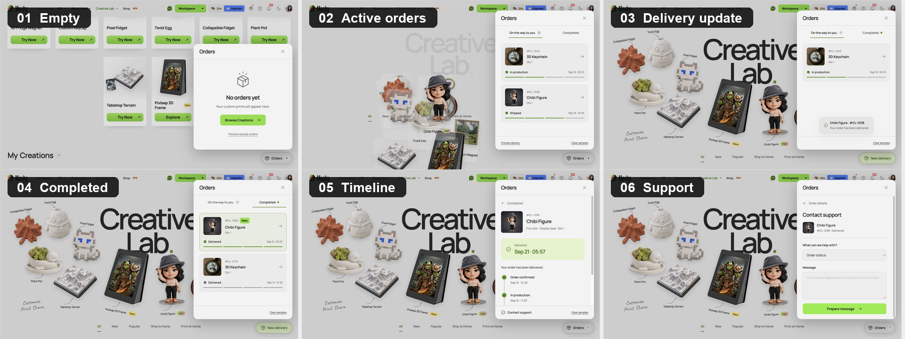
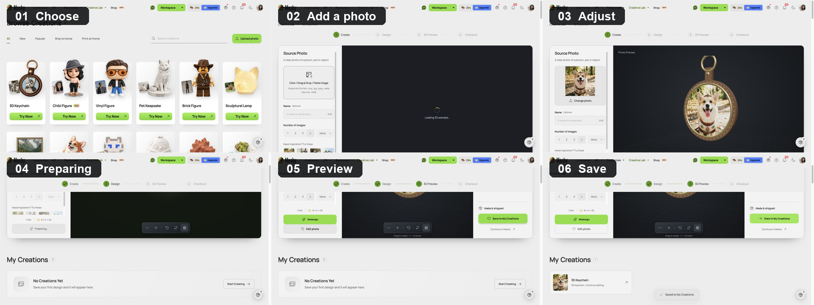

# Meshy Creative Lab 改版说明

**Senior Product Builder · Product UI & Visual Design**

本方案调整了 Creative Lab 的首屏展示、内容编排、定制流程和订单入口。桌面首屏以多品类成品构成创作能力的视觉索引，品类浏览与照片定制在同页完成，How 与 Why 合并展示，品类目录和 FAQ 增加搜索。订单从首屏中的固定信息块改为持续可达的浮动入口，覆盖查看进度、送达提醒和联系客服。

绿色符号从首屏的 2D 方块延续到页尾可打开的 3D 胶囊，通过停靠、移动和形态变化串联各模块的视觉与交互。

实际投入约 **3–4 天**，AI 工具为 **Codex**。交付包括 1440px 桌面页面、移动端适配、深浅主题和可运行原型。

[代码仓库](https://github.com/RongzhangGu/meshy-test) · [提交版本 fd45bc0](https://github.com/RongzhangGu/meshy-test/tree/fd45bc09f87f7dc01f722dde6dff0967d8388e67)



*配图 01 · 首屏中的物件沿用到目录卡片，保留从灵感展示到品类浏览的视觉连续性。*

## 01 · UI & Visual Design

### 内容编排与表单细节

原页面将 How 与 Why 分为两个模块，分别介绍创作流程和产品价值。本次合并两部分的相关内容，减少说明区的篇幅，将作品浏览和创作入口集中在页面前半部分。

Business 表单同步调整了输入框填充色、文字颜色和控件层级，以统一表单与页面其他部分的样式。

原页面把 Orders 作为目录旁的首屏信息块，移动端则放在页面上方。该位置曝光很高，但会长期占用创作入口附近的空间，并在用户离开首屏后失去可见性。本方案将其改为固定在视口右下角的轻量入口：没有订单时保持低干扰；出现进行中订单或新的送达状态时，通过数量、未读标记和文案变化提高优先级。



*配图 02 · 原版将 Orders 放在目录右侧，并分开呈现 How 与 Why；新版释放首屏空间，以常驻入口承接订单，并将操作与价值配对。*

### 首屏 Hero

桌面首屏以多种代表性产品围绕标题排布，结合大字号标题、手写标注和尺度变化，把可制作的物件直接转化为创作能力的视觉索引。用户不必先阅读分类说明，就能从成品形态理解 Creative Lab 的范围。

物件采用不同的展示比例，并通过位置和留白控制画面疏密。向下滚动时，首屏物件进入 Browse Creations，逐渐显示来源图片、品类名称和 Try Now / Explore 按钮。展示与目录沿用相同物件，便于继续查找首屏中感兴趣的品类。

移动端直接显示双列目录。卡片省略说明文字，保留图片、名称、标签和创作按钮，缩短卡片高度，增加单屏可浏览的品类数量。

### How & Why It Works

合并后的模块按四步组织：选择创作、AI 设计、预览与定制、打印或订购。每一步同时介绍操作及相应价值，减少流程说明与产品介绍之间的重复。

该模块位于创作区域之后，供用户进一步了解制作与交付流程。桌面首次滚动到这里时，步骤逐渐展开，之后可直接阅读或手动切换；移动端和减少动态效果模式下直接展示完整内容。

### 绿色符号：从 2D 到 3D

绿色符号始于首屏的二维方块，随后在目录、My Creations、Business、流程、FAQ 和工具模块之间停靠。进入流程模块时，它从标题字形进入步骤轨道；到达页尾后与 “Here” 中的字母发生碰撞，并在同一位置从二维圆点长成可以打开的三维胶囊。从平面到立体的变化呼应照片或想法转化为实体物件的过程，也为各模块提供统一的视觉标识。

符号只在内容关系发生切换时移动，阅读正文时停留在当前锚点。下落、碰撞、压缩和小幅回弹让它具有重量感，同时避免持续漂浮干扰阅读。页尾胶囊提供可操作的开合效果，并与上传照片和返回目录的操作一起形成页面收束。



*配图 03 · 绿色符号从二维标记、Business 下划线和流程节点，最终转化为页尾的三维胶囊。*

### 订单入口与履约状态

一旦用户产生实物订单，付款后的生产和交付状态通常会比继续浏览新品更紧迫。方案因此没有继续让 Orders 占据目录旁的大面积首屏位置，而是将它设计成跨页面持续可达的浮动按钮，在不打断浏览的情况下保留稳定入口。

桌面点击后打开侧边面板，移动端使用底部面板。内容按“运输中”和“已完成”分组，订单详情展示产品、数量、当前状态、预计送达和完整时间线。送达更新会产生页面内通知和未读状态；用户从具体订单进入客服时，订单编号、产品与进度会自动成为求助上下文，减少重复说明。

### Design System

页面以黑、白、灰为基础色，绿色用于主要按钮、选中状态和贯穿页面的符号。

| 颜色 | Dark | Light |
| --- | --- | --- |
| 页面背景 | `#101113` | `#EDEDED` |
| 基础表面 / 提升表面 | `#191B1E` / `#25282C` | `#F3F3F3` / `#E5E5E5` |
| 主要文字 / 次要文字 | `#F2F3F3` / `#A5A9AF` | `#292929` / `#636363` |
| 分隔线 | `#303338` | `#D2D2D2` |
| 强调色 | `#C4F76B`，主要按钮使用亮绿色材质 | 按钮填充 `#85DF35`，小尺寸强调文字使用深绿色 |

字体使用 Manrope Variable，首屏手写注释使用 Caveat。常规模块标题为 32px / 600，移动端为 26px；Business 标题分别为 28px 和 24px。图标使用 Phosphor，上传、搜索、保存等操作带有文字标签或可访问名称。

| 基础组件 | 样式 | 主要状态 |
| --- | --- | --- |
| 按钮 | 主要动作使用绿色，次要动作使用中性色 | Default、Hover、Focus、Pressed、Disabled |
| 输入与表单控件 | 保留标签，区分输入内容、提示和错误信息 | Empty、Focus、Filled、Error、Disabled |
| 选择控件 | 分类、数量和参数选项显示当前选中项 | Default、Selected、Hover、Focus、Disabled |
| 作品卡片 | 物件占主要面积，名称和操作入口位置固定 | Default、Hover、Keyboard focus、Touch |



*配图 04 · 深浅主题共用相同的信息层级，绿色集中承担主操作、选择和状态反馈。*

### 关键界面状态

| 状态 | 处理方式 |
| --- | --- |
| 浏览与聚焦 | 悬停或键盘聚焦显示产品原始场景，名称与操作入口保留；手机直接显示场景 |
| 暂无作品 | My Creations 显示空状态和 Create your first 入口 |
| 上传失败 | 提示文件类型、大小或读取问题，保留已有有效照片 |
| 暂无订单 | 解释订单出现的位置，并提供返回 Browse Creations 的入口 |
| 履约进行中 | 区分生产、运输和完成状态，展示进度、时间线和预计送达 |
| 新的送达状态 | 浮动入口变为 New delivery，并通过通知和未读标记提示用户查看 |



*配图 05 · Orders 从低干扰的空状态逐步提高信息密度，并在送达和求助时提供明确反馈。*

## 02 · Interaction Design + Vibe Coding

### 照片定制流程

交互场景为首次使用照片定制作品。流程提供“先选品类”和“先上传照片”两种入口，适配已有目标品类和已有素材的不同情况。

```text
浏览 / 搜索品类 → Try Now → 上传照片
或：上传照片 → 预览照片并选择创作类型
                  ↓
           同页工作区：调整参数
                  ↓
            启动设计 → 查看预览
                  ↓
           保存到 My Creations
                  ↓
         重新打开继续编辑 / 返回目录

上传异常 → 提示原因，保留原照片 → 更换文件后继续
```

该流程适用于照片创作。Terrain 和 Pixleap 按各自的地图、展示设备用途提供入口说明和预览。

### 五个关键状态

| 状态 | 操作与反馈 |
| --- | --- |
| 1. 选择品类 | 浏览、分类筛选、关键词搜索；显示建议和清空入口 |
| 2. 上传照片 | 预览来源照片、选择品类；提示输入要求和文件问题 |
| 3. 调整参数 | 选择数量、样式等参数，显示时间与额度的演示估算；缺少照片时不能启动 |
| 4. 等待预览 | 显示准备进度，暂时禁用重复启动 |
| 5. 查看与保存 | 查看结果、返回修改，或保存到 My Creations 后重新打开 |



*配图 06 · 同一示例照片贯穿选择、输入、参数调整、等待、预览和保存，便于对照状态变化。*

### 同页工作区

点击 Try Now 后，主区域直接切换为当前品类的工作区，并显示面包屑、任务进度和参数设置。同页展开用于保持浏览与定制的连续性，减少页面跳转带来的中断。

上传照片、调整参数和查看预览均在工作区内完成。返回目录时保留照片、参数和搜索内容，避免重复输入。

移动端先显示照片与参数设置，生成预览后自动定位到结果。3D 预览的外观设置和保存操作紧随结果展示，返回编辑时重新定位到输入区。

当前作品仅保存在页面会话中。跨会话继续编辑和分享方案，还需补充持久化保存、刷新恢复和独立链接。

### 订单与售后流程

Orders 不并入首次创作的主任务链，而是作为创作之后持续存在的服务入口：

```text
无订单 → 查看空状态 → 返回 Browse Creations

存在订单 → 打开常驻入口 → 进行中 / 已完成
                           ↓
                    查看状态与时间线
                           ↓
                    携带订单上下文联系客服

送达更新 → 页面内通知与未读标记 → 查看 Completed → 标记已读
```

浮动按钮在没有新信息时保持紧凑；有进行中订单或送达更新时才提高视觉权重。这样既不会让低频订单入口持续占据首屏，也不会要求正在等待商品的用户返回页面顶部查找进度。

### 品类与 FAQ 搜索

Browse Creations 目前包含 14 类创作，支持名称、预设用途关键词和分类组合查找。搜索提供直接定位品类的入口，也为后续品类增长预留查找方式。

FAQ 支持问题、答案和主题的组合检索。关键词出现在答案中时，相关问答直接展开，减少逐项打开的操作。无匹配结果时提供清空搜索和重选主题的入口。

问答内容保留定制、文件、打印、交付和使用权等主题及相关链接，用于覆盖长尾问题。站内搜索侧重答案查找效率；搜索引擎收录与自然流量表现待上线后验证。

### 动效与异常反馈

目录展开时，首屏物件连续进入对应卡片，展示其位置变化；进入工作区时，浏览控件切换为任务控件，提示操作阶段的变化。绿色符号的跨模块移动延续整页的视觉联系。订单送达后，浮动入口、未读标记和页面内通知共同反馈状态变化。移动端和减少动态效果模式下可直接访问内容。

上传校验包括文件格式、大小和图像读取。更换失败或取消选择时，原有有效照片保持不变，用户可重新选择文件后继续。搜索无结果、暂无作品和 3D 预览加载失败均提供对应反馈。

### 原型实现范围

目录搜索、本地照片上传、参数调整、预览、会话内保存和重新打开均可操作。钥匙扣可查看照片嵌入模型后的效果，灯具使用 STL 示例，其他品类展示对应参考。订单面板使用本地样例数据演示空状态、进度筛选、详情时间线、送达通知和客服消息准备。

生成过程使用本地演示，尚未接入真实 AI 生成、扣费和结算。订单样例未连接真实账户、支付、物流订阅或客服提交；Business 表单提交后仅生成本地摘要。

## 03 · Product Thinking

### 优化目标：从浏览作品进入首次创作

本次选择“浏览作品后启动首次定制”作为优化目标。首屏展示成品，目录提供对应入口，用户可在选定品类后上传照片并开始设计。

这一环节直接涉及成品理解、品类选择和素材提交，适合通过一条完整的照片定制流程进行验证。方案将产品展示和操作入口相邻安排，并保留输入状态，预期减少查找入口与重复操作的成本。

How & Why 和 FAQ 位于创作区域之后，补充流程、交付及其他问题的说明。整体顺序为作品浏览、定制尝试、流程说明和问答查询。

### 为什么调整 Orders

Orders 不属于本轮“首次创作启动”的核心转化指标，但它代表用户完成付费后的另一类高优先级任务。原版将订单入口放在目录右侧，移动端放在内容顶部，能够获得首屏曝光，却会在用户向下浏览或进入其他模块后失去可见性。

对于已经产生订单的用户，生产是否正常、商品何时送达以及出现问题后如何求助，通常比继续浏览目录更紧迫。因此方案用常驻按钮交换首屏面积：入口始终可达，但只有在存在进行中订单或未读送达更新时才增强视觉提示。该调整用于补足创作后的服务链路，不改变本轮优先验证的首次创作目标。

### 验证计划

第一轮计划选择一个照片品类，观察从进入目录到点击 Start Design 的完整过程。重点记录品类查找、上传要求的理解，以及操作中断的位置。

计划邀请 5–8 位首次接触页面的用户，完成品类查找、照片上传、参数调整、保存和问答查询任务。例如，选择适合宠物照片的品类并保存方案，再查找交付或文件格式的信息。此项用户测试尚未开展。

| 验证项 | 观察方式 |
| --- | --- |
| 产品理解 | 请用户说明可制作的物件与所需输入 |
| 创作启动 | 记录有效照片和品类选择是否完成、是否点击 Start Design |
| 操作障碍 | 记录耗时、停顿、回退和重复操作 |
| 品类搜索 | 记录目标查找结果、无匹配结果和关键词改写情况 |
| FAQ 查询 | 记录答案查找的正确率与耗时 |

接入真实生成服务后，可统计从浏览到首次有效启动的比例，分别记录按钮点击、任务创建成功和生成完成。流量具备对照测试条件后，再比较新旧方案的表现。

同时观察 Hero 展开时长和滚动动效是否影响目录访问。若出现等待或操作中断，可缩短展开过程，提前显示操作入口。

## 04 · AI 使用与交付

### 时间投入

实际投入约 3–4 天。核心布局和主流程在前期确定，后续主要打磨视觉和交互细节，包括物件比例、图文关系、表单颜色、滚动节奏、按钮反馈及移动端适配。

### Codex 的使用

本次使用的 AI 工具为 Codex。设计决策由设计者负责，Codex 协助代码实现、素材处理、调试和文档整理。

| 工作部分 | 设计决策 | Codex 协助 |
| --- | --- | --- |
| UI | 首屏构图、模块篇幅、配色、订单入口与绿色符号的变化 | 页面实现、素材处理及样式调整 |
| 交互 | 同页工作区、两种创作入口、搜索范围、订单状态与动效要求 | 交互逻辑实现、异常状态检查与调试 |
| Product Thinking | 基于原页面观察确定改版范围和优先流程 | 整理口述内容、补充验证计划、核对文档与实现 |
| 交付 | 确定保留内容和整理范围 | 清理废弃代码与重复资源、运行检查、整理说明 |

组件、展示图和模型的来源记录保留在仓库中，其中包含 AI 生成与处理的展示素材。

### 交付检查

- 66 项自动测试通过，生产构建通过。
- 桌面和手机检查覆盖 14 类工作区，以及搜索、上传、保存、重新打开、主题、Business、FAQ 和 Orders。
- 订单检查覆盖空状态、状态筛选、详情时间线、送达通知、未读恢复和客服入口。
- 动效检查覆盖目录展开、流程步骤、跨模块移动、碰撞回弹和页尾胶囊开合，并提供减少动态效果模式。

本地启动方式见 [项目 README](../README.md)。建议体验路径：Hero → 品类目录 → 使用示例照片启动预览 → 保存并返回 → Orders 样例与送达通知 → FAQ 搜索 → 主题切换与页尾胶囊。

后续工作包括用户测试，以及真实生成、跨会话保存、分享和结算的接入。

---

> 待补：Hero 展开、绿色符号旅程和 Orders 送达通知的交互录屏。正式提交前删除本行。
